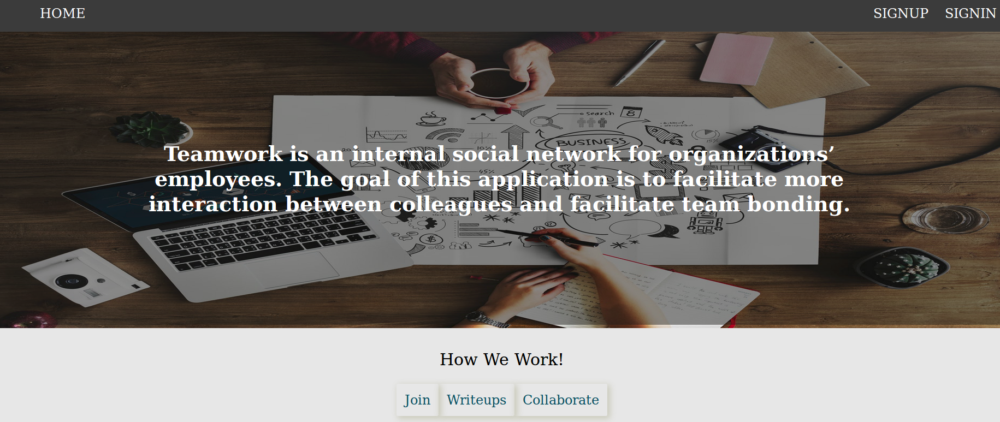

# Teamwork
> Interact, Collaborate, and have funs with your workmates

## What  Teamwork do
>Teamwork is an​ internal social network for organizations’ employees. The goal of this application is to facilitate more interaction between colleagues and facilitate team bonding

>

## Technologies used
>Front end
- html
- css
- vanilla javascript (__es6__)
- __Note:__ no framework has been used

>Backend
- nodejs
- express 
>Testing
- mocha framework
- chai assertion libray
- chai-http for integration
>transpiler
- babel 7
>linting
- eslint (__airbnb__ style guide)

## Installation
>You can access the platform via [github pages](https://itsuk45.github.io/teamwork/UI/html/)

>To insatll locally,

 
- `git clone `[repo](https://github.com/itsUk45/teamwork) 

- `cd teamwork` to change the project directory
- `npm install ` to install required dependencies

>To run on the cloud 
- teamwork is happily hosted on heroku.
- find the heroku links [here](https://teamwork-kose.herokuapp.com/api/v1)

## Testing
- `npm start` to start the server
- `npm test` to test the app
>Using postman for testing
>>user
- `localhost:3000/api/v1/auth/signup` to create new user account
- `localhost:3000/api/v1/auth/signin` to login to the platform
>>articles
- `localhost:3000/api/v1/article/article` to see existing articles
- in the similar way access other routes

## API Documentation
The doc was created with love by [postman](https://www.getpostman.com/). Postman is a platform for testing and api development, you can find the links to teamwork documentation [here](https://documenter.getpostman.com/view/9023297/SVtR3WJU?version=latest#intro)

## Pivotal Tracker
Insterested in reading the PVT stories? find teamwork platform PVT board stories [here](https://www.pivotaltracker.com/n/projects/2399537)

## Author
    uk45

## License
>This project is listed under the MIT license, see details [here](#)

